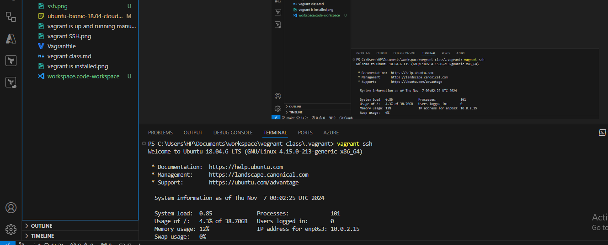

Package Management Project

Step 1: Access the Linux System

Step 2: Open a Terminal

Step 3: Update Package Repositories

Step 4: Install a Package

Step 5: Remove a Package

Step 6: Search for Packages

Step 7: List Installed Packages

Step 8: Upgrade Installed Packages

