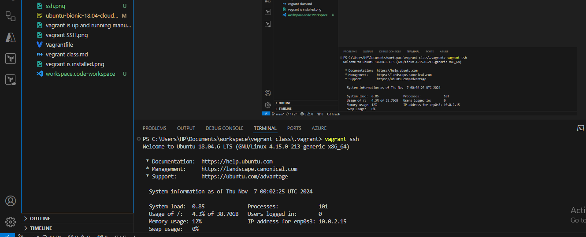

User and Group Management Project

Step 1: Access the Linux System

Step 2: Open a Terminal

Step 3: Create a New User

Step 4: Set a Password for the New User

Step 5: Create a New Group

Step 6: Add User to a Group

Step 7: Verify User and Group Creation

Step 8: Modify User and Group Information

Step 9: Delete a User

